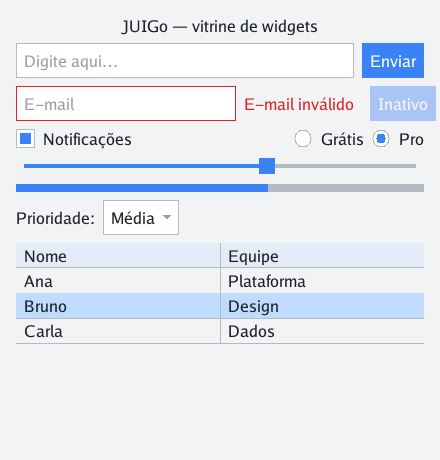
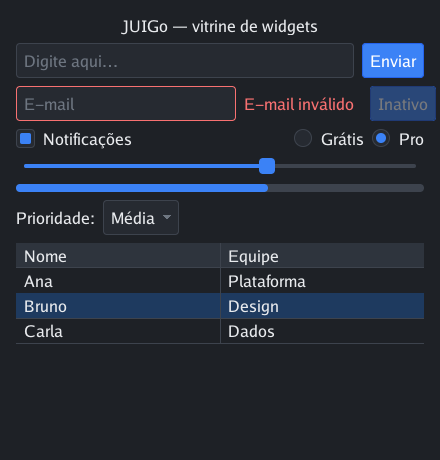
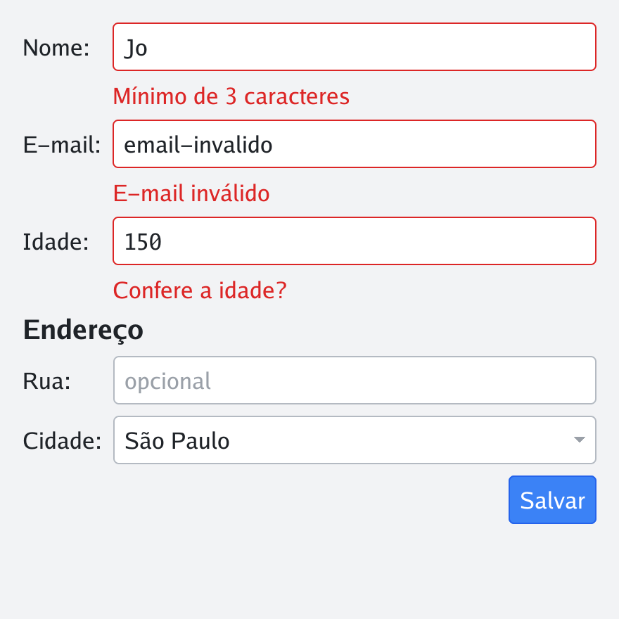
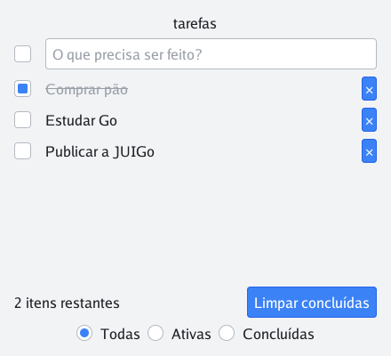
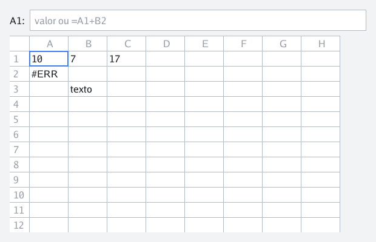
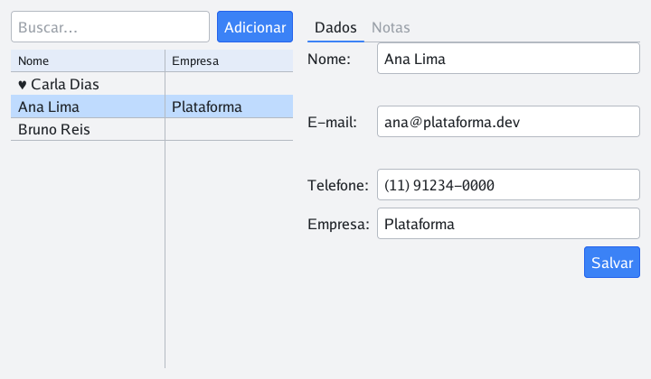
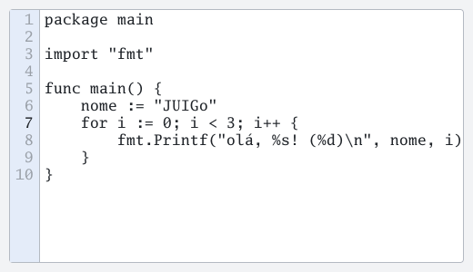
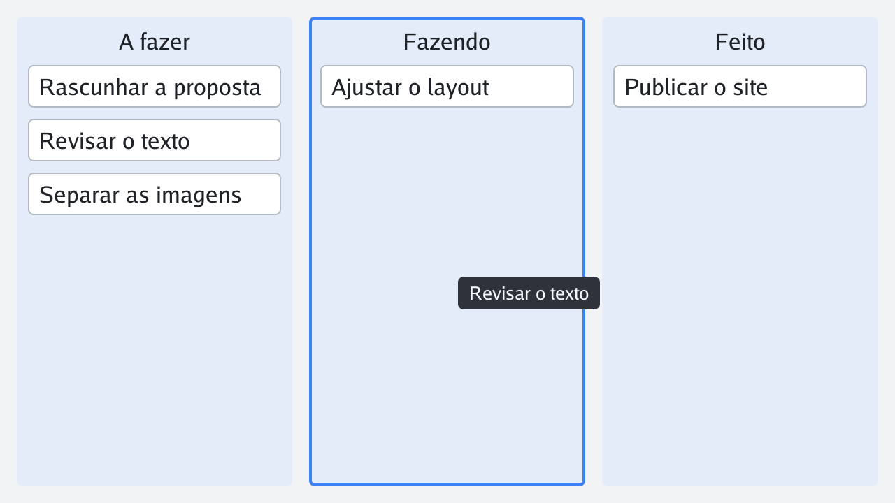

# JUIGo

[](https://github.com/JonathanSantos/JUIGo/actions/workflows/testes.yml)
[](https://pkg.go.dev/github.com/JonathanSantos/JUIGo)
[](LICENSE)

Biblioteca de interface gráfica desktop em Go, escrita **do zero** como
projeto de estudo (**J**onathan + **UI** + **Go**): renderização por
software num `*image.RGBA`, reatividade tipada com generics, formulários
validados em uma expressão e um framework de testes de UI determinístico —
tudo atrás de um único `import`.

> *JUIGo is a desktop GUI library for Go, built from scratch as a study
> project: software rendering, typed reactive state, a validated-forms
> layer and a deterministic UI-testing harness. The documentation is in
> Brazilian Portuguese.*

| Tema claro | Tema escuro (troca em runtime) |
| --- | --- |
|  |  |

*As screenshots desta página são geradas pela renderização offscreen da
própria lib — [`go run ./docs/gerar`](docs/gerar/main.go).*

## Por que JUIGo

- **20+ widgets** — Text, Button, Input (seleção — inclusive palavra por
  duplo clique —, clipboard, filtro), TextArea
  com soft wrap, CodeEditor (fonte mono, gutter, tabs, undo coalescido,
  linhas virtualizadas e highlight de sintaxe INCREMENTAL — lexers Go/JSON
  em `juigo/syntax`, contrato aberto para os seus), Checkbox, Radio,
  Slider, ProgressBar, Dropdown, Image, Tabs, Modal, Popup ancorado,
  Tooltip, Grid, List virtualizada e Table com cabeçalho fixo — ambas com
  seleção como State e reordenação por arrasto (`OnReorder`, com indicador
  de inserção).
- **Reatividade tipada** — `State[T]` + `Map`/`Combine`, bindings de duas
  vias (`BindValue`, `BindChecked`, `BindSelected`, `BindDisabled`,
  `BindInvalid`) e tudo declarável inline, sem variáveis temporárias.
- **Formulários em uma expressão** — a camada `quick`: campos com handles
  tipados, validação com mensagens suas, erros por campo e Enter enviando;
  além de diálogos (`Confirm`/`Alert`/`Prompt`), menu de contexto (`Menu`)
  e avisos transitórios (`Toast`) de uma chamada.
- **Testável de verdade** — `uitest` dirige o MESMO núcleo de interação do
  App real, headless, com relógio virtual (nada de sleeps) e screenshots
  determinísticos para golden tests.
- **Rápida por construção** — dirty regions (só a região suja é repintada e
  enviada à GPU), zero alocações no caminho quente, ~14µs por frame
  incremental; um golden test prova que o frame incremental é byte a byte
  igual ao completo.
- **HiDPI, temas em runtime, múltiplas janelas (`App.NewWindow`, cada uma
  com tema e foco próprios, States compartilhados entre elas), drag-and-drop
  (`StartDrag`/`DropTarget`, com fantasma e realce do alvo), undo/redo
  (`History`), timers (`After`/`Every`), animações (`anim.Tween`) e um
  inspector de depuração (Ctrl/Cmd+I)** de fábrica.

## Status

Projeto de **estudo**, em evolução ativa. Versionado por tags `v0.x`
(primeira: `v0.1.0`) — na série 0.x a API ainda quebra entre versões, sem
janela de depreciação. Desenvolvido e verificado no macOS; Linux e Windows
têm as dependências mapeadas abaixo, mas ainda não foram testados. Issues e
correções são bem-vindas.

## Instalação

Requisitos: Go 1.26+, toolchain C (o GLFW compila via cgo) e os headers de
janela/GL da sua plataforma:

- **macOS**: Xcode Command Line Tools (`xcode-select --install`)
- **Linux**: `libgl1-mesa-dev libx11-dev libxrandr-dev libxi-dev libxcursor-dev libxinerama-dev`
- **Windows**: toolchain gcc (MSYS2 ou TDM-GCC)

```bash
go get github.com/JonathanSantos/JUIGo
```

A fonte **Go Regular** ([go.dev/blog/go-fonts](https://go.dev/blog/go-fonts),
licença BSD do projeto Go) é embutida via `go:embed` — binários JUIGo não
dependem de fontes do sistema.

## Primeiros passos

```go
package main

import (
	"log"

	juigo "github.com/JonathanSantos/JUIGo"
)

func main() {
	nome := juigo.NewState("mundo")
	ui := juigo.NewVBox(
		juigo.NewText("").BindText(juigo.Map(nome, func(s string) string {
			return "Olá, " + s + "!"
		})).Center(),
		juigo.NewInput("Seu nome…").BindValue(nome),
	).Pad(16)

	if err := juigo.Run("Olá, JUIGo", 360, 140, ui); err != nil {
		log.Fatal(err)
	}
}
```

Digite no campo e o título reage a cada tecla — o `State` é a única fonte
de verdade e a interface é uma projeção dele.

## As ideias que sustentam a DX

- **Tudo declarável inline** — callbacks e opções são métodos encadeáveis
  que devolvem o tipo concreto, no estilo dos `Bind*`:
  `NewInput("E-mail").BindValue(mail).OnSubmit(enviar)`,
  `NewSlider(0, 1).Step(0.1).OnChange(f)`,
  `NewModal(conteúdo).CloseOnBackdrop(false).OnClose(f)`. Qualquer
  interface cabe em uma única expressão.
- **Tema ambiente** — construtores não pedem tema: o App o injeta na árvore
  no *mount*. `DefaultTheme` (claro) e `DarkTheme` (escuro) prontos, ambos
  com cantos arredondados com antialiasing (`Theme.Radius`, padrão 4);
  `ClassicTheme` (ou `Radius = 0`) devolve o visual reto de antes, pixel a
  pixel. `App.SetTheme` troca em runtime. Métricas são unidades lógicas
  escaladas pelo tema — HiDPI transparente.
- **Reatividade com `State[T]`** — `NewState`/`Get`/`Set`/`Watch` + `Map` e
  `Combine` para derivados; `Set` redesenha a interface sozinho. Eventos
  continuam callbacks (`OnClick`) — estado é para dados.
- **Layout sem cerimônia** — `VBox`/`HBox` com `Grow(w, peso)`, `Spacer`,
  `Centered`/`AtStart`/`AtEnd`; `Grid(n, …)` para formulários alinhados;
  `Scroll` (com eixo horizontal opcional) e `List`/`Table` virtualizadas
  para milhares de linhas com um punhado de widgets.
- **Disabled e loading centrais** — `BindDisabled(w, estado)` tira o widget
  (e a subárvore) da interação no roteamento, com esmaecimento;
  `Button.BindLoading` mostra spinner e implica desabilitado.
- **Trabalho assíncrono com `App.Post`** — o único método thread-safe:
  goroutine trabalha, `Post` entrega o resultado à main thread.
- **Undo, timers e seleção** — `NewHistory` (pilhas + `CanUndo`/`CanRedo`
  prontos para botões), `After`/`Every` no relógio da aplicação,
  `BindSelected` fazendo da linha selecionada um State como outro qualquer.

## Formulários com `quick`



```go
nome  := quick.Text("Nome:").Required("Informe o nome").Min(3, "Mínimo de 3")
email := quick.Text("E-mail:").Email("E-mail inválido")
idade := quick.Number("Idade:", 18).Max(120, "Confere a idade?")

quick.Form(nome, email, idade).Submit("Salvar", func() {
    salvar(nome.Value(), email.Value(), idade.Value()) // string, string, int
})
```

Cada campo é um **handle tipado** dono do próprio State — a variável é a
"chave" do formulário, verificada pelo compilador. A grade alinha rótulos e
campos, os erros aparecem por campo (no blur ou no envio, na cor de erro do
tema, com borda vermelha no controle), Enter envia, `Section` divide
formulários longos. `quick.Confirm/Alert/Prompt` abrem diálogos de uma
chamada. E a regra da rampa: tudo aceita e devolve widgets comuns — quando o
padrão pronto não servir, desça um nível naquele ponto sem reescrever a
tela.

## Testando sua aplicação

O `uitest` dirige o mesmo núcleo de interação do App real (roteamento,
foco, captura, overlay), headless e sem sleeps:

```go
func TestFormulario(t *testing.T) {
	h := uitest.New(t, ui, 480, 240)
	h.Click(uitest.Placeholder("Digite…")) // foca de verdade
	h.Type("olá, ação")                    // runes, com acentos
	h.Hover(uitest.Text("Enviar"))
	h.Advance(600 * time.Millisecond)      // relógio virtual: tooltip aparece
	img := h.Screenshot()                  // determinístico → golden tests
}
```

Seletores por texto, placeholder, tipo (`OfType[*juigo.Button]()`) e
predicado; `Advance` dispara timers, animações e piscada de cursor na
ordem, sem dormir. **Ctrl/Cmd+I** em qualquer app abre o inspector de
depuração: contornos, realce sob o ponteiro e um crachá com tipo, bounds e
flags de cada widget.

## Exemplos

| | |
| --- | --- |
|  |  |



- **`go run ./examples/basic`** — a demo reativa: bindings, formulário
  validado num modal, tema escuro ao vivo, lista virtualizada de 500 itens,
  animação de rolagem e trabalho assíncrono com `Post`.
- **`go run ./examples/7guis`** — o benchmark clássico
  [7GUIs](https://eugenkiss.github.io/7guis/) completo: contador, conversor
  de temperatura, reserva de voo, cronômetro, CRUD, desenho de círculos com
  undo/redo e uma mini-planilha com fórmulas — cada um num pacote com
  testes de uitest ([o que o exercício rendeu à lib](examples/7guis/GAPS.md)).
- **`go run ./examples/todo`** — TodoMVC em três camadas (domínio puro,
  view-model, composição), com persistência JSON, edição inline por duplo
  clique e testes de domínio e de UI.
- **`go run ./examples/contatos`** — mestre-detalhe: busca + tabela à
  esquerda, detalhe em abas (`Tabs`) com formulário validado e notas à
  direita; seleção preservada por identidade no filtro, menu de contexto no
  botão direito (`quick.Menu`), exclusão com confirmação e toasts.
- **`go run ./examples/kanban`** — drag-and-drop: cartões arrastados entre
  colunas com fantasma e realce do alvo, cancelamento no Escape e a UI
  reconstruída da projeção do modelo.
- **`go run ./examples/janelas`** — multi-janela: `App.NewWindow`, tema por
  janela (uma escura ao lado de claras) e o MESMO `State` reagindo em todas
  ao mesmo tempo.
- **`go run ./examples/editor [arquivo]`** — o CodeEditor: highlight de
  sintaxe incremental (Go/JSON pela extensão; abrir um `/*` re-lexa só até
  o estado convergir), auto-indentação, Tab/Shift+Tab indentando o bloco
  selecionado (um passo de undo), linha atual e par de parênteses
  realçados (pulando strings/comentários), gutter numerado, undo/redo
  coalescido, rolagem 2D virtualizada com indicadores, quebra visual de
  linhas opcional (`WrapLines`; o padrão é rolagem horizontal), tamanho de
  fonte por editor (`FontSize`) e Go Mono ↔ Fira Code embutidas
  (`Theme.UseMonoFont`), além de "ir à linha" por composição com
  `quick.Prompt`.





Testes de tudo (rodam sem janela):

```bash
go test ./...
```

## Arquitetura

Renderização 100% por software sobre um `*image.RGBA` (GLFW para
janela/eventos; OpenGL só apresenta o buffer), single-threaded na main
thread, loop dirigido a eventos com dirty regions, e o pacote raiz como
fachada — aplicações importam só `github.com/JonathanSantos/JUIGo`. A
organização de pacotes, os contratos (Widget, roteamento por geometria e
por foco, overlay, tema) e os números de performance estão em
[docs/ARQUITETURA.md](docs/ARQUITETURA.md).

## Fora de escopo (por enquanto)

Acessibilidade, IME (composição de texto asiático — avaliação e plano em
[docs/IME.md](docs/IME.md)), edição rica (negrito/itálico) e árvores. A
arquitetura foi pensada para recebê-los depois: eventos são tipos abertos,
o tema é injetado, containers são aninháveis e o desenho é isolado em
`render/`.

## Licença

[MIT](LICENSE). A fonte Go Regular embutida segue a
[licença BSD do projeto Go](https://go.dev/LICENSE).
