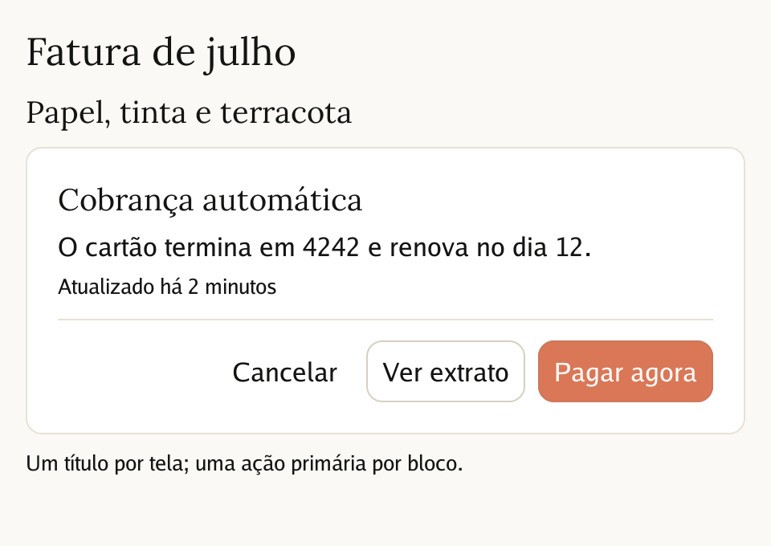
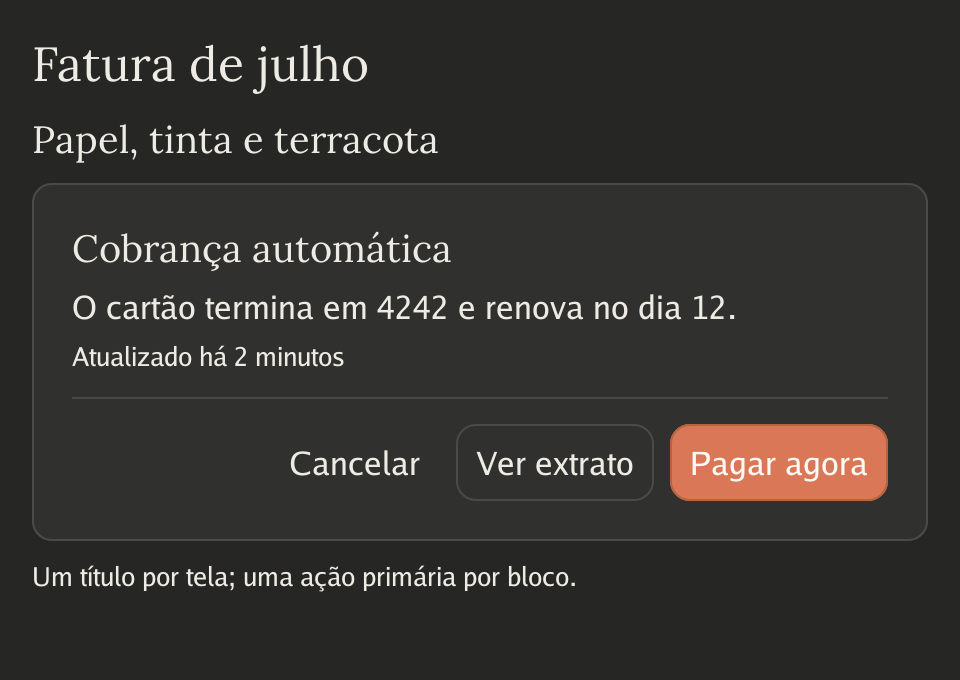
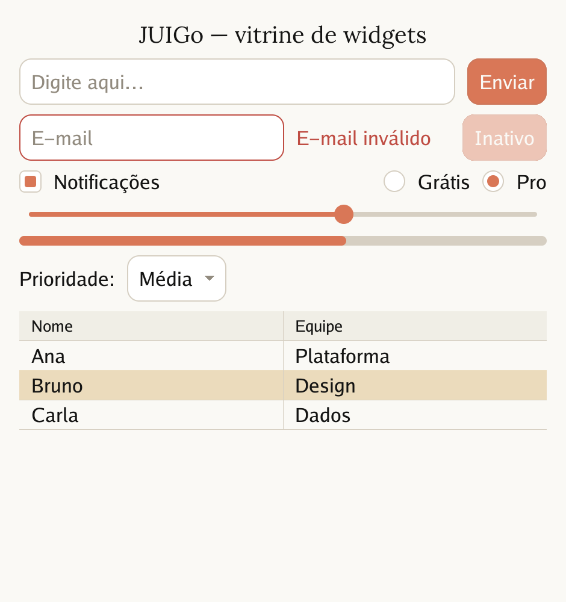
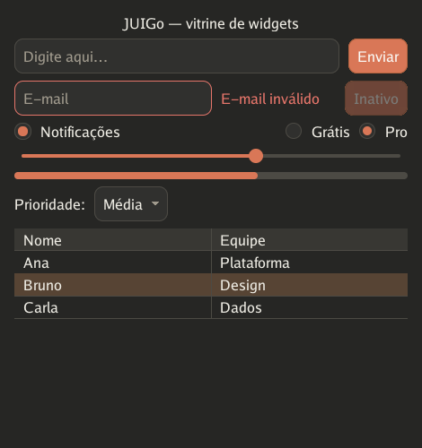

# Design system "papel e tinta"

A identidade visual pronta do JUIGo, inspirada na linguagem visual pública
do Claude (Anthropic): papel, tinta, terracota e uma serif de livro nos
títulos. É uma homenagem aproximada — o tema não usa marcas nem representa
a Anthropic; as cores vêm da paleta térrea publicada na identidade da
empresa, e a serif é a [Lora](https://github.com/cyrealtype/Lora) (OFL),
embutida.

| Claro | Escuro |
| --- | --- |
|  |  |
|  |  |

```go
th, _ := juigo.ClaudeTheme()       // claro
noite, _ := juigo.ClaudeDarkTheme() // escuro — mesmas métricas, troca sem pular

app, _ := juigo.New("Meu app", 800, 600)
app.SetTheme(th)
```

## Princípios

1. **Papel e tinta.** O fundo claro é papel (`#FAF9F5`), o texto é tinta
   quente (`#141413`). No escuro os papéis se invertem: superfícies de
   grafite quente (`#262624`) e texto cor de papel. Tooltips invertem de
   novo — tinta sobre papel no claro, papel sobre grafite no escuro.
2. **Terracota é ação.** Uma única cor de destaque (`#D97757`): botões,
   borda do campo focado, marca do checkbox/radio, trilho ativo do slider,
   sublinhado da aba, realce de drop. Se não é ação nem estado ativo, não é
   terracota — a cor nunca decora.
3. **Neutros sempre quentes.** Bordas, placeholders, faixas e divisores
   puxam para o bege/kraft; não existe cinza azulado no sistema. A seleção
   de texto é manilla (`#EBDBBC`) no claro e kraft profundo (`#574434`) no
   escuro — papel marcado, não azul de sistema.
4. **Formas generosas.** `Radius` 10 e `Padding`/`Spacing` 10 — mais curva
   e mais respiro que o tema Default. Os dois modos compartilham TODAS as
   métricas: alternar claro/escuro em runtime não move um pixel de layout.
5. **Estados sempre visíveis.** Foco tem anel (terracota funda no claro,
   clareada no escuro), desabilitado é lavagem translúcida do fundo, hover
   de listas é aveia (`#F0EEE6`) / grafite claro (`#383733`).

## Tokens

O design system é o próprio `juigo.Theme` preenchido — cada token abaixo é
um campo público; derive e sobrescreva à vontade.

| Token | Papel na interface | Claro | Escuro |
| --- | --- | --- | --- |
| `Background` | papel da janela | `#FAF9F5` | `#262624` |
| `Text` | tinta | `#141413` | `#EDEBE3` |
| `Placeholder` | sugestões, rótulos apagados | `#928B7F` | `#A09A8D` |
| `ButtonNormal` | ação primária | `#D97757` | `#D97757` |
| `ButtonHover` / `ButtonPressed` | ação sob ponteiro / apertada | `#E08A6C` / `#BD5F3D` | `#E08A6C` / `#B0532E` |
| `ButtonText` / `ButtonBorder` | rótulo e fio do botão | `#FAF9F5` / `#CC785C` | `#FAF9F5` / `#B5643F` |
| `InputBackground` | campos de texto | `#FFFFFF` | `#30302E` |
| `InputBorder` / `InputBorderFocused` | fio do campo / focado | `#D6CFC2` / `#D97757` | `#4C4A44` / `#D97757` |
| `Selection` | seleção de texto e de linhas | `#EBDBBC` | `#574434` |
| `FocusOutline` | anel de foco | `#C15F3C` | `#E39A7D` |
| `Accent` | marcas ativas (checkbox, slider, abas) | `#D97757` | `#D97757` |
| `HoverBackground` | item sob o ponteiro | `#F0EEE6` | `#383733` |
| `TooltipBackground` / `TooltipText` | dica | `#141413` / `#FAF9F5` | `#F0EEE6` / `#141413` |
| `Danger` | erros e ações destrutivas | `#BF4D43` | `#E5756A` |
| `CurrentLine` | faixa da linha do cursor (CodeEditor) | `#F2EFE7` | `#2E2E2B` |
| `Radius` / `Padding` / `Spacing` | forma e respiro | 10 / 10 / 10 | 10 / 10 / 10 |
| `RowPad` | respiro de linha e margem da pílula (List/Tree) | 4 | 4 |

Sintaxe (CodeEditor), na mesma família térrea:

| Classe | Claro | Escuro |
| --- | --- | --- |
| `Keyword` | `#B0512F` (terracota funda) | `#E5876A` |
| `String` | `#667B4E` (oliva) | `#A9BC8F` |
| `Number` | `#4E7396` (azul-névoa) | `#8FB4D9` |
| `Comment` | `#8C857A` | `#8F8A80` |
| `Builtin` | `#9A6B2F` (kraft) | `#D4A27F` |

## Tipografia

A hierarquia vem de PAPÉIS tipográficos do tema, não de tamanhos avulsos:

| Papel | Como usar | Fonte | Tamanho lógico |
| --- | --- | --- | --- |
| Título | `NewText("…").Title()` | display (Lora no papel e tinta) | `TitleSize` 24 |
| Subtítulo | `.Subtitle()` | display | `SubtitleSize` 19 |
| Corpo | `NewText("…")` | regular (Go) | `FontSize` 16 |
| Legenda | `.Caption()` | regular, menor | `CaptionSize` 13 |

A fonte de display é um token trocável (`Theme.UseDisplayFont`): Go Bold
nos temas Default/Dark (hierarquia por peso, zero assets), a serif Lora no
papel e tinta (`theme.Lora()`; `theme.LoraBold()` para títulos mais
pesados). Regras de uso: **um Título por tela**, Subtítulo abre seções e
cartões, legenda para metadados — combine `.Caption()` com
`Color(Theme.Placeholder)` quando quiser apagá-la junto. Tudo reescala com
o tema (HiDPI) e troca em runtime.

## Componentes e hierarquia

- **Botões em três níveis:** primário (preenchido de terracota — a ÚNICA
  ação principal do bloco), `Secondary()` (superfície com fio, texto de
  tinta — ações comuns) e `Ghost()` (só o rótulo; hover ganha fundo —
  ações discretas, barras densas). Numa barra de ações, no máximo um
  primário, à direita.
- **Card** agrupa conteúdo numa superfície elevada (`Surface` +
  `SurfaceBorder` + raio do tema, respiro interno de 2×Padding). Cartão é
  agrupamento, não decoração: se tudo na tela é cartão, nada é.
- **Divider** separa regiões DENTRO de uma superfície (o fio
  `SurfaceBorder` com o respiro embutido); entre widgets comuns, prefira
  espaço (`Gap`) a fios.

## Listas e árvores

Coleções seguem o layout do sistema, não só as cores:

- **Linhas respiram** — a altura de linha de `List` e `Tree` é o conteúdo
  mais `RowPad` em cima e embaixo; densidade vem do tema, não de cada
  tela.
- **Realce é pílula, não faixa** — seleção e hover são formas arredondadas
  (`Radius`) com margem `RowPad` dos dois lados, como itens de uma
  sidebar; o hover usa `HoverBackground` e aparece em qualquer lista
  selecionável.
- **Conteúdo com recuo** — o texto da linha nasce dentro da pílula (na
  `Tree`, depois da coluna do chevron), nunca colado na borda.
- **Coleção flutuante vive num poço** — uma lista dentro de um diálogo
  fica num `Card` (superfície + fio), não solta sobre o fundo do modal; o
  seletor de arquivos do `quick` é o exemplo canônico.

## Espaçamento e forma

Tudo em unidades lógicas do tema (escalam no HiDPI): a régua é o `Padding`
(10) — respiro de controle = 1×, respiro de cartão = 2×, `Gap` entre
grupos = `Spacing` (10). `Radius` 10 nos controles e superfícies; a faixa
de pega do SplitPane, recuo da Tree e demais métricas herdam do tema.

## Movimento

O movimento do sistema é o das transições de tela (`Navigator`):
`Theme.TransitionDuration` de 280ms com easing suave, deslizar para
avançar/voltar e fade para substituir. Animações extras devem usar
`anim.Tween` sobre os mesmos timers — nada de movimento decorativo.

## Estendendo

Derive do par pronto e sobrescreva tokens — as regras acima continuam
valendo para o que você criar:

```go
th, _ := juigo.ClaudeTheme()
th.Danger = color.RGBA{R: 0xA8, G: 0x3E, B: 0x32, A: 0xFF} // seu tom
th.Radius = 6                                              // menos curva
```

Duas regras mantêm a identidade ao estender: terracota continua exclusiva
de ação/estado ativo, e qualquer cor nova nasce da família térrea (aqueça o
neutro antes de usá-lo). Para conferir contraste, a régua prática é: tinta
sobre papel e papel sobre terracota sempre legíveis; se um par novo ficar
mais fraco que esses, escureça o fundo ou o texto.

As capturas desta página saem de `go run ./docs/gerar` (offscreen,
determinístico) — regenere após qualquer ajuste de token.
